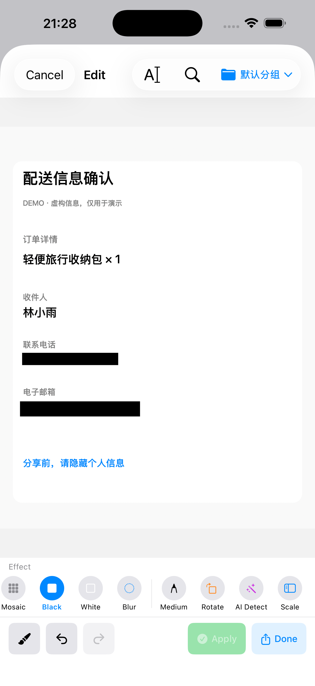
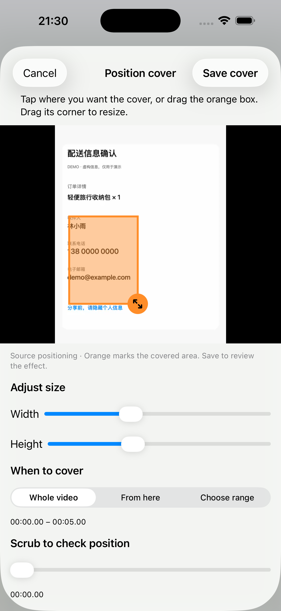
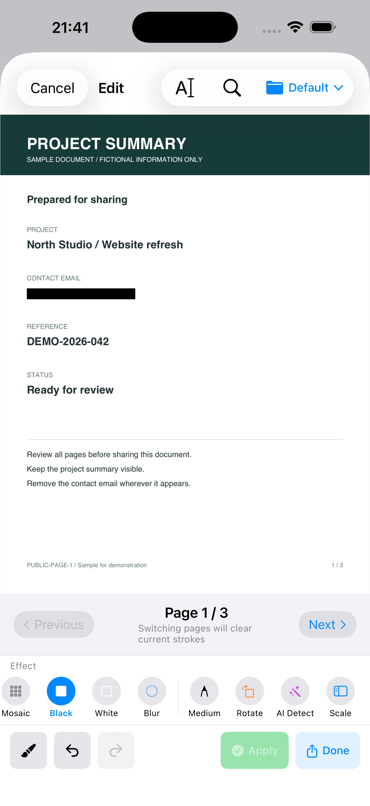

<div align="center">

# ZeroNet Redact

**Redact photos, videos and PDFs on your iPhone and iPad.**

**照片、视频、PDF，一处完成本地脱敏。**

[Download on the App Store](https://apps.apple.com/app/id6756290503) · [Website / 官网](https://zeronet-redact.materialofair.chatgpt.site/en/)

No account required · On-device processing · One-time upgrade, no subscription

[English](#english) | [中文](#中文)

</div>

| Photos / 照片 | Videos / 视频 | PDFs / 文档 |
|:--:|:--:|:--:|
|  |  |  |

Actual app screens with fictional examples. The orange video box is an editing selection. / 真实应用截图，内容均为虚构示例；视频橙色框表示编辑选区。

---

## 中文

v1.5 开发内容与验证记录见 [v1.5 开发交付说明](docs/v1.5-development-notes.md)，包括加密草稿、文字搜索、PDF 导航、系统分享导入与导出处理记录。

### 为什么做这个应用？

发送照片、视频或 PDF 前，先遮住不想公开的信息。ZeroNet Redact 支持图片文字与人脸复核、视频指定区域和时段遮挡、PDF 敏感文字搜索与逐页处理，再导出副本用于分享。视频手动框位置固定，请完整预览移动内容。

**文件内容在设备本地处理，无需上传原文件。自动检测可能遗漏信息，分享前请检查完整导出结果。**

### 核心理念

- **离线处理** — 脱敏操作无需网络；购买和恢复购买使用 Apple 服务
- **本地处理** — 所有脱敏操作都在你的设备上完成，没有云端、没有服务器
- **隐私至上** — 无账号、无追踪、无广告，我们不知道你是谁，也不想知道
- **开源透明** — 开源不是为了免费，而是为了让你可以验证我们的承诺，建立彼此的信任

### 功能特性

- 手势涂抹马赛克
- 矩形遮挡（黑条/白条）
- 高斯模糊
- 撤销/重做
- 加密存储原图
- 本地视频人脸检测与动态采样，支持强模糊与卡通贴纸遮挡；自动检测可能遗漏，请人工复核
- 视频时间区间手动补框、重画、逐段复核，以及用户确认的人物片段分组与统一效果
- 图片/PDF/视频加密草稿恢复；重复文字搜索、滑选文字与局部放大镜
- 图片批处理：统一识别规则、逐张复核、暂停恢复、失败重试，成功项在同批次中不重复导出
- PDF 待处理页面导航、图片/PDF 分享扩展及基于实际输出的处理记录
- 固定匿名男声、匿名女声、机器人和静音预设
- 视频原件认证分块加密，处理与换声完全离线
- 导出到相册或分享

### 系统要求

- iOS 17.6+
- iPhone / iPad

### 安装

从 [App Store](https://apps.apple.com/app/id6756290503) 下载，或访问[产品官网](https://zeronet-redact.materialofair.chatgpt.site/)。

免费版每天可导出 3 个 PDF，以及合计 3 个图片/视频；免费视频源文件上限为 300 MB。一次性内购可解除这些限制并解锁高级贴纸，无订阅。价格以当地 App Store 为准。

或克隆代码自行编译：

```bash
git clone https://github.com/materialofair/ZeroNet_Redact.git
cd ZeroNet_Redact/zeroNetRedact
open zeroNetRedact.xcodeproj
```

### 隐私政策

**我们的承诺：不收集任何数据。**

- 所有图片、PDF 和视频处理都在本地完成
- 加密文件仅存储在你的设备上
- 我们不会上传任何图片或数据
- 我们不会追踪你的使用行为

### 反馈与建议

如果你有任何问题或建议，欢迎通过 [GitHub Issues](https://github.com/materialofair/ZeroNet_Redact/issues) 与我们联系。

### 许可证

[GPL-3.0 License](LICENSE)

App 自身代码以 GPL-3.0 许可；二进制链接 MuPDF（AGPL-3.0）后按 AGPL-3.0
分发（GPLv3 §13），详见 [THIRD_PARTY_NOTICES.md](THIRD_PARTY_NOTICES.md)。

---

## English

### Why This App?

Hide a phone number in a photo, cover a private detail in a video, or redact text in a PDF. ZeroNet Redact brings all three workflows together: import, review, cover, and export a copy. Manual video covers stay in a fixed position; preview moving content carefully.

**Content is processed on your device without uploading your originals. Automatic detection can miss details; review the entire exported result before sharing.**

### Core Philosophy

- **Offline Processing** — Redaction works offline. Purchases and restoring purchases use Apple services.
- **Local Processing** — All redaction happens on your device. No cloud, no servers.
- **Privacy First** — No accounts, no tracking, no ads. We don't know who you are, and we don't want to.
- **Open Source** — Open source isn't about being free—it's about letting you verify our promises and building mutual trust.

### Features

- Gesture-based mosaic drawing
- Rectangle masking (black/white bars)
- Gaussian blur
- Undo/Redo
- Encrypted storage for originals
- On-device video face detection with adaptive sampling, blur, or stickers; detection may miss content and requires review
- Manual timed rectangles with redraw, segment review, and user-confirmed person grouping with shared effects
- Encrypted image/PDF/video drafts; repeated-text search, swipe selection, and a magnifier
- Image batches with shared rules, per-image review, pause/resume, and retry without re-exporting successful items in the same batch
- Pending PDF page navigation, image/PDF share extension, and factual output processing reports
- Fixed anonymous male, anonymous female, robot, and mute voice presets
- Authenticated chunk encryption for source videos; processing and voice effects stay offline
- Export to Photos or Share

### Requirements

- iOS 17.6+
- iPhone / iPad

### Installation

Download from the [App Store](https://apps.apple.com/app/id6756290503) or visit the [product website](https://zeronet-redact.materialofair.chatgpt.site/en/).

Try 3 PDF exports and 3 combined photo/video exports per day for free. Free video exports support source files up to 300 MB. A one-time purchase removes these limits and unlocks premium stickers. No subscription; see your local App Store for pricing.

Or clone and build:

```bash
git clone https://github.com/materialofair/ZeroNet_Redact.git
cd ZeroNet_Redact/zeroNetRedact
open zeroNetRedact.xcodeproj
```

### Privacy Policy

**Our Promise: We collect nothing.**

- All image, PDF, and video processing happens locally
- Encrypted files are stored only on your device
- We never upload any images or data
- We never track your usage

### Feedback

If you have any questions or suggestions, feel free to reach out via [GitHub Issues](https://github.com/materialofair/ZeroNet_Redact/issues).

### License

[GPL-3.0 License](LICENSE)

The app's own source code is GPL-3.0; the distributed binary links MuPDF
(AGPL-3.0) and is therefore distributed under AGPL-3.0 (GPLv3 §13). See
[THIRD_PARTY_NOTICES.md](THIRD_PARTY_NOTICES.md).

---

<div align="center">

Made with privacy in mind.

</div>
